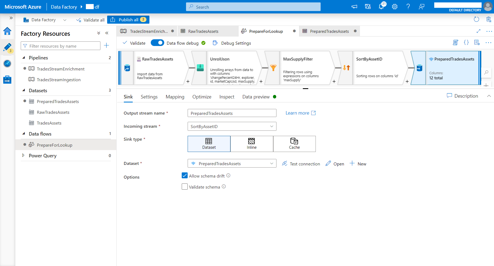

# Reactive-Ingestion-System


# Notice about workflows

## Ingestion Pipeline
* Connects to websocket with trades data, send event to Event Grid Topic(to start Enrichment Pipeline) and than starts streaming to Event Hub.
* Example use case: To stream data with 24 hours duration every 24 hours.
## Enrichment Pipeline
* After event trigger it copies static dataset for enrichment from REST API via Copy Activity than processes using Dataflow Activity(unrolls json, filters it, sorts it, converts to parquet for rapid lookup from stream and than save it in data lake). Than Notebook Activity comes into play, it starts Spark Structured Streaming from Event Hub, combines this data with our lookup dataset. Eventually enriched data goes to Azure SQL database while in real-time appears on Power-BI dashboards(static reports also possible).
## Ingestion Analytics & Alerting via Azure Functions and Logic Apps
* Overall workflow was configured in such way that every time when Time Trigger will start Ingestion Pipeline it will trigger launch of new Enrichment Pipeline and finishing of previous one. So, every time when Enrichment will finishing it will lauch Azure Function which will create if needed Metrics Table, calculate ingested rows in Consumption Table, calculate ingested rows delta(if metrics have already been added) and if this delta less than custom threshold Azure Function will trigger Logic App that will send alert with Ingestion Run payload to the email.

### 1. Databricks Workspace
- 1. After creation launch your workspace and navigate to User Settings tab to generate access token. We'll need this token in further steps, so save it somewhere:
        

- 2. Configure secrets workspace:
        1. Create Azure Key Vault.
        2. Navigate to Networking tab and choose 'Selected networks' checkbox also select 'Yes' to trust Azure Services:
        
        3. Navigate to Access Policies tab to add policy and principal(you) to have access to use key vault:
        
        4. Now you able to create secrets workspace in databricks that will connect to your key vault:
                Launch your databricks workspace than add following end-point -> [#secrets/createScope]
                Than add DNS name and Resource ID (can be found in Properties tab in your Azure Key Vault):
        
     So, now we can use our workspace to manage secrets in notebooks.

### 2. Event Hub
1. During creation enable data capture from your Event Hub to data lake:

2. When deployed navigate to 'Shared access policies' tab to add policies for read and write access:

3. Then add 'Connection string–primary key' from this SAS policies to out Azure Key Vault as secrets:


### 3. Event Grid Topic
1. Navigate to 'Access keys' tab and add the first key to your Key Vault.
2. Also you can add your topic's end-point to Key Vault.

### 4. Azure SQL Database
1. Edit server firewall rules by adding Public Databricks Cluster IP, so that we'll be able to access Database server:
* We can find it in databricks service Resource Group


2. Also we'll need JDBC connection string for Spark.

### 5. Power-BI Streaming Dataset
* And you'll be able to push streaming data to this dataset's end-point:


### 6. Data Factory [Ingestion Pipeline]
0. Also we need to provide access to Key Vault from Data Factory(to enable creation of Linked Services through Key Vault).
* Create Access Policy in Key Vault with required permissions and specify Data Factory's object id as Policy Principal.
1. Set up ingestion pipeline:
* To enable using databricks notebooks in our pipeline we need to create Linked Service which references to previously created Databricks workspace:

2. Add streaming notebooks:

3. Tell cluster to install required libraries:


### 7. Data Factory [Enrichment Pipeline]
1. To use REST API as a source for Copy Activity we need to create REST Linked Service:


2. Then we need to create dataset that references to data in previously created REST Linked Service. After creation open it and specify relative url(end-point) to our data:


3. Then create Linked Service for Azure Data Lake Gen2
4. Create dataset in which our REST data will be saved:

5. Now we can set up Dataflow Activity:
* As a source use previously created raw-json dataset:

* Now unroll this json with Flatten Transformation:

* Then we'll use Filter Transformation to filter out rows:

* Also we can sort it using Sort Transformation:

* And finally store it in data lake as a parquet file:

6. Add pipeline parameters:
* We'll specify pipeline parameters(storage account and container for prepared trades assets) than we pass them to Notebook Activity as widgets:

7. Add pipeline variable (folder for Prepared Assets, we'll initialize it using Get Metadata and Set Variable Activities):

8. Add Get Metadata Activity to catch path of data after Dataflow Activity, choose 'Item name' and add this to field list. It will be our directory:

9. Add Set Variable Activity to inialize our pipeline's dicrectory variable:

* Choose directory variable name and set following dynamic value to it:

10. Now we'll add our Structured Streaming notebook and pass to it pipeline's parameters and values as widgets:


### 8. Add Custom Event Trigger To Enrichment Pipeline
* Subject and Event Type fiels are important because trigger will work only for specified subset of events. So, when sending event to trigger Enrichment Pipeline use the same parameters:


### 9. Azure Function
1. As function will access Azure SQL server will need to configure this workflow:
* Enable system assigned managed identity in Function App, so that our function can register in Azure Active Directory:

* Create user in database and set following roles:
```
CREATE USER "enrichment-metrics" FROM EXTERNAL PROVIDER;
ALTER ROLE db_datareader ADD MEMBER "enrichment-metrics";
ALTER ROLE db_datawriter ADD MEMBER "enrichment-metrics";
```
* So now we can connect to server using AAD Managed Server Identity: Function App will send request to database, database will check corresponding database user and permissions.
2. Add Azure Function as activity to Enrichment Pipeline:
* Create Linked Service for Function App:

* Add activity to Pipeline:

* Add Pipeline parameters, so that pass them to Azure Function:

* Pass following parameters to POST request body (we'll need them to choose Ingestion Table and Logic App for alerting):
```
{
        "ingestion_table":"@pipeline().parameters.ingestion_table",
        "logic_app_url":"@pipeline().parameters.logic_app_url",
        "ingestion_time":"@pipeline().TriggerTime"
}
```

### 10. Logic Apps
1. Workflow design:
* Configure Trigger:

* Configure Mail Action(email's body parameters are taken from ADF Azure Function activity via POST request):


### 11. Results
#### Trigger Runs
* 
#### Event Hub Data Capture
* 
#### Power-BI real-time dashboards
* 
* 
#### Power-BI reports
* 
#### Azure SQL Ingestion Table
* 
#### Azure SQL Metrics Table
* 
#### Ingestion Metrics Alert
* 